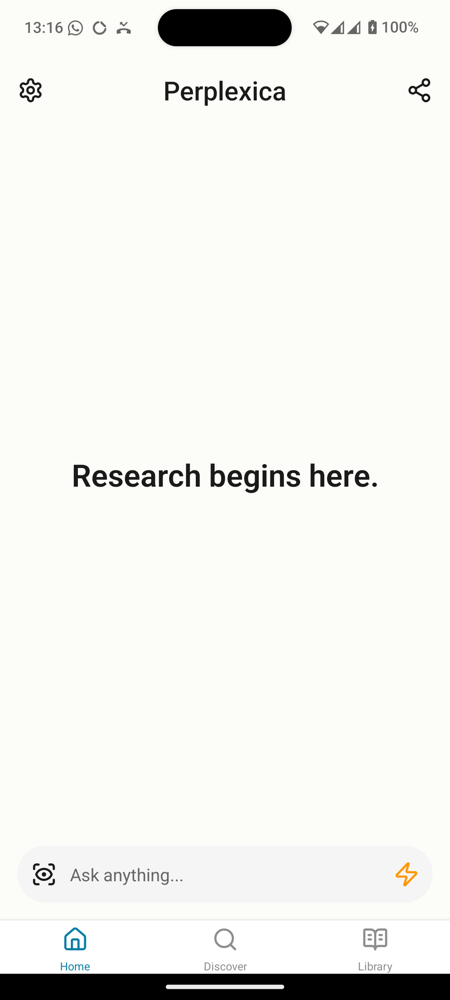
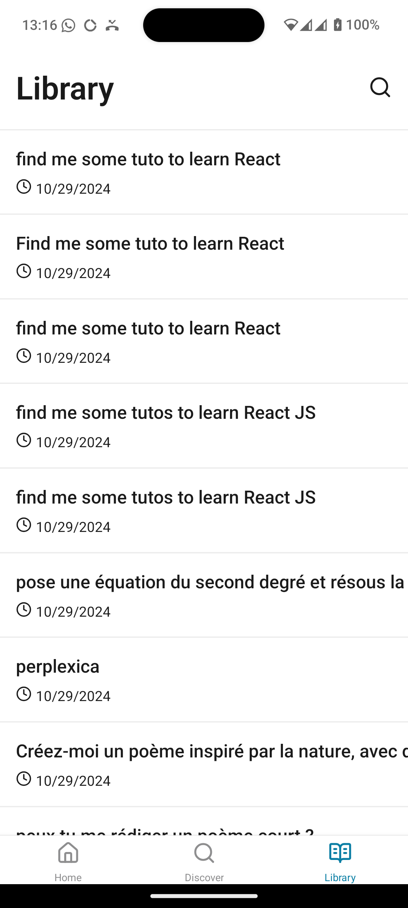
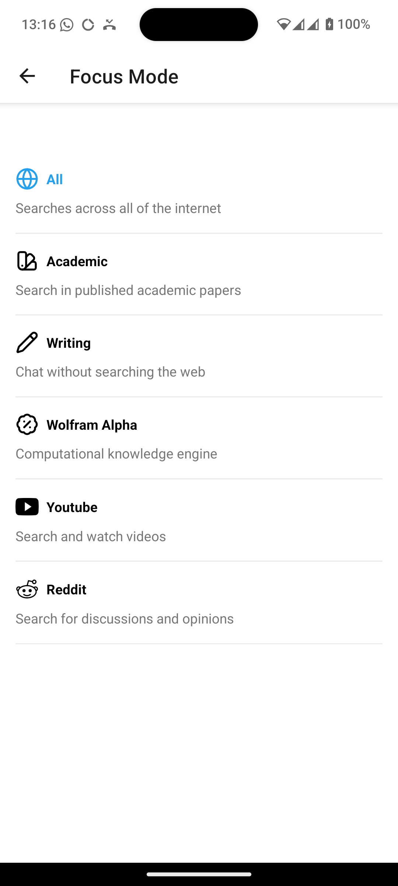
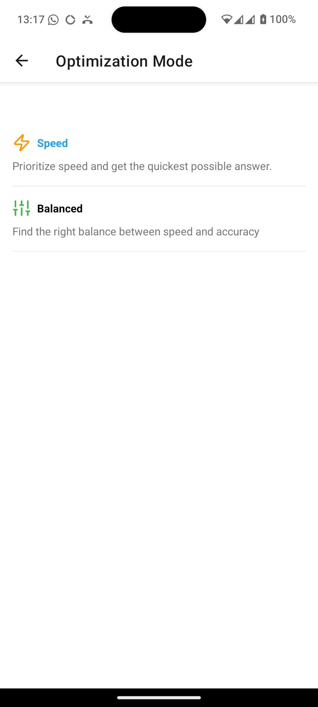

# PerplexicApp

This is an unofficial cross-platform mobile App for the [Perplexica](https://github.com/ItzCrazyKns/Perplexica) project created with [`create-expo-app`](https://www.npmjs.com/package/create-expo-app).

## Context

I've been very excited about using Perplexity, but like many products, it's closed-source so there's no privacy guarantee. When I discovered the Perplexica project, I immediately loved it!

Being a Web Developer, I started developing a Perplexity-like app. Some features are still inactive but will be developed soon. Feel free to contribute!

This is my first Open Source project, so thank you for any helpful and respectful advice!

Made with ❤️

PS: I'm French, so please excuse any writing mistakes 😅

## Screenshots

<div style="display: flex; flex-wrap: wrap; gap: 10px; justify-content: center;">
  
  
  
  
  
</div>

## Getting Started

1. Install dependencies

   ```bash
   npm install
   ```

2. Start the app

   ```bash
    npx expo start
   ```

## Settings

In the settings page, you can at this time set the Server and Websockets URL of the running instance of your Perplexica (mine is running on my Mac Studio so I've put my internal IP)

## ToDo

- Format Response Text (bold, lists, etc)
- Change more settings like models
- Fix Library item text overflow
- Clean code
- Refacto
- Write tests
